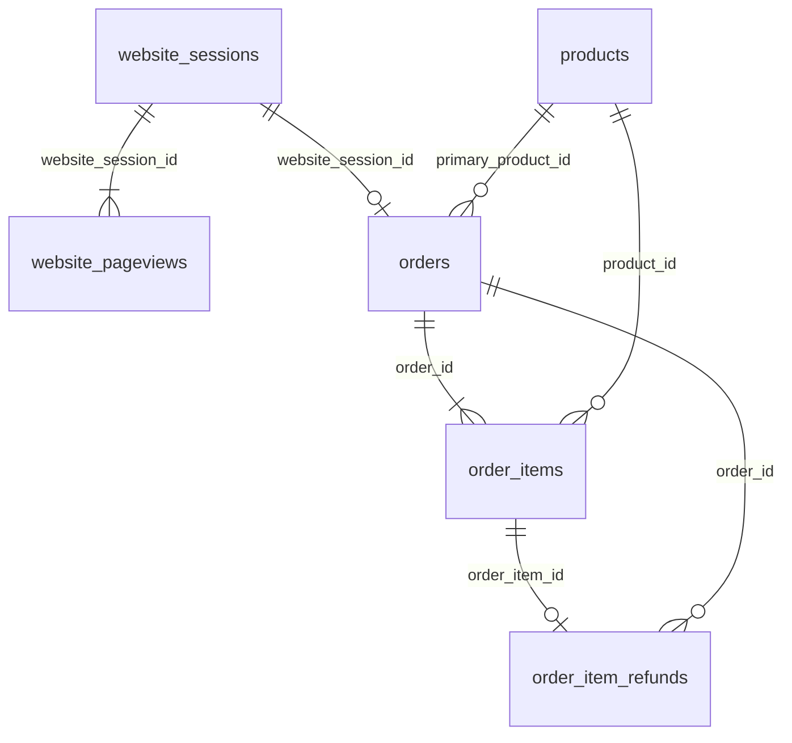
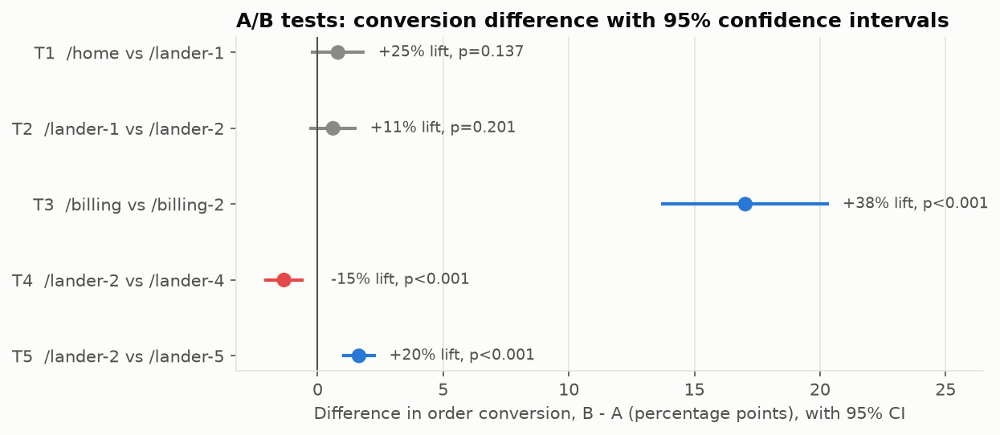
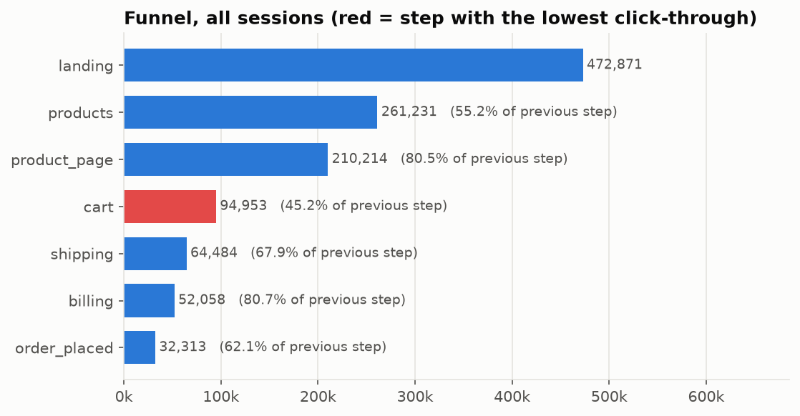
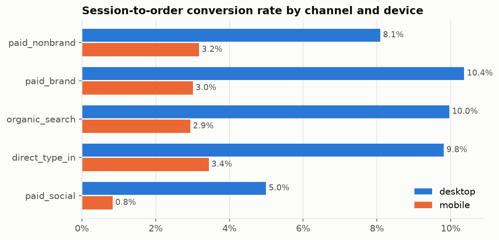
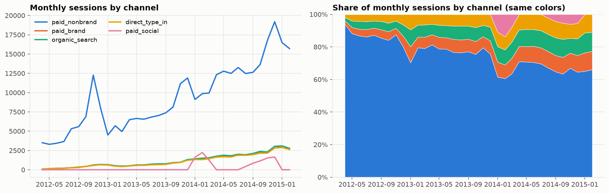
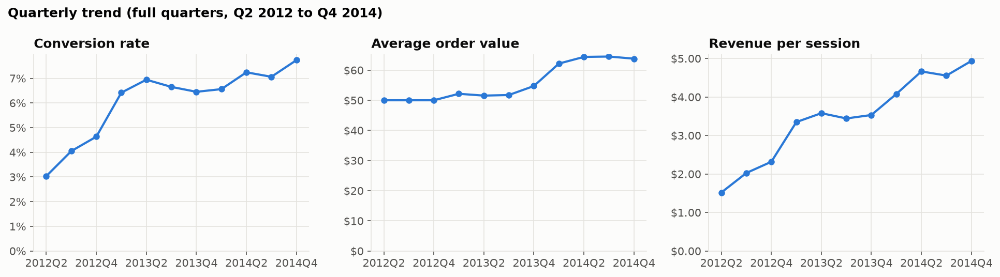
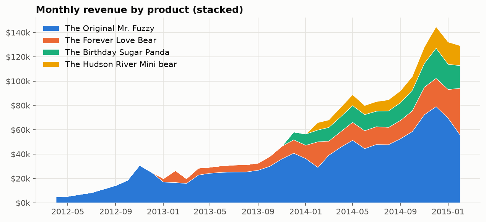
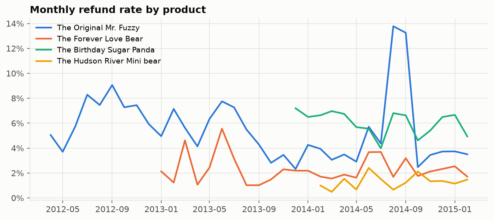
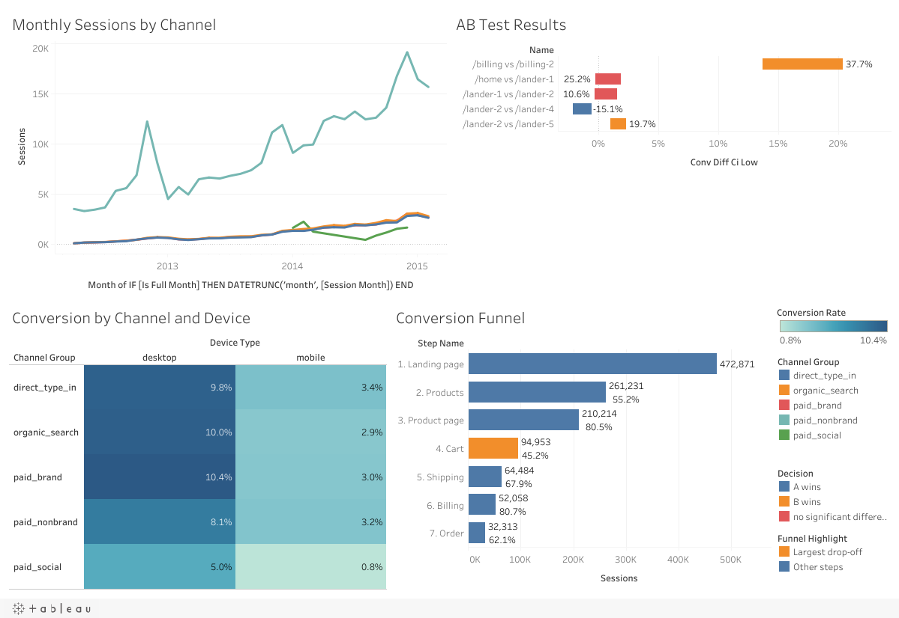

# E-commerce Funnel & A/B Test Analysis

Which traffic brings buyers, where visitors drop out, and whether the website experiments really worked,
for an online retailer with 472k sessions and 32k orders (Maven Fuzzy Factory, 2012-2015).


[](https://public.tableau.com/app/profile/mainak.das6780/viz/MavenFuzzyFactory-FunnelandABTestAnalysis/FunnelandABTestOverview)

---

## Business problem

Maven Fuzzy Factory sells teddy bears online and buys most of its traffic from paid search. Leadership asked:

> Which traffic channels and devices bring customers who actually buy, where do visitors drop out before purchasing,
> did our website experiments really work, and what should we change next?

## Results at a glance

| | |
|---|---|
| Biggest funnel leak | Product page to cart: only **45.2%** continue (115k sessions lost) |
| Mobile gap | **30.8%** of sessions but **14.1%** of revenue; converts at 3.09% vs 8.50% on desktop |
| Best test | New billing page: billing-to-order conversion **45.1% to 62.1%** (+37.7%, p < 0.001) |
| Best landing page | /lander-5: order conversion **8.37% to 10.02%** (+19.7%, p < 0.001) |
| Test value | The two winning pages are worth about **+$15,500 a month** at test-period traffic |
| Traffic quality | Revenue per session tripled, **$1.52 to $4.93** (Q2 2012 to Q4 2014) |

## Data

[Maven Fuzzy Factory](https://mavenanalytics.io/data-playground) from the Maven Analytics Data Playground:
6 CSV tables, 2012-03-19 to 2015-03-19. The raw files are not in the repo. Download them with:

```bash
mkdir -p data/raw
curl -L -o /tmp/fuzzy.zip "https://maven-datasets.s3.amazonaws.com/Maven+Fuzzy+Factory/Maven+Fuzzy+Factory.zip"
unzip -o /tmp/fuzzy.zip -d data/raw
```

| Table | Rows | Grain |
|---|---:|---|
| website_sessions | 472,871 | one website visit, with utm source/campaign, device, referer |
| website_pageviews | 1,188,124 | one page viewed in a session |
| orders | 32,313 | one order (at most one per session) |
| order_items | 40,025 | one product in an order |
| order_item_refunds | 1,731 | one refunded item |
| products | 4 | one product |



The full data dictionary, page inventory, detected experiments and data-quality checks are in
[`reports/data_understanding.md`](reports/data_understanding.md).

**Channel grouping** (built from utm tags and referer):

| Channel | Rule | Sessions |
|---|---|---:|
| paid_nonbrand | `utm_campaign = 'nonbrand'` | 337,615 |
| paid_brand | `utm_campaign = 'brand'` | 41,243 |
| paid_social | `utm_source = 'socialbook'` | 10,685 |
| organic_search | no utm tag, search-engine referer | 43,411 |
| direct_type_in | no utm tag, no referer | 39,917 |

## Methodology

1. **Data understanding** ([`src/profile_raw.py`](src/profile_raw.py)): profiled every table, mapped the keys, and listed every page URL
   with its first and last date. Pages that shared traffic for a limited time revealed five A/B tests.
2. **Load and validate** ([`sql/01_schema.sql`](sql/01_schema.sql), [`src/load_to_postgres.py`](src/load_to_postgres.py),
   [`sql/02_validation.sql`](sql/02_validation.sql)): typed schema with keys and indexes, loaded with chunked `COPY`.
   Checks: row counts, orphan keys, order total = sum of items, refunds <= item price, linear funnel. All pass.
   [`sql/views.sql`](sql/views.sql) builds `v_sessions_enriched`: one row per session with channel, landing page,
   funnel flags, order and revenue.
3. **SQL analysis** ([`sql/03`](sql/03_traffic_and_conversion.sql), [`04`](sql/04_funnel.sql),
   [`05`](sql/05_product_and_revenue.sql)): conversion by channel and device, MoM/YoY growth, channel mix, funnel and
   drop-off ranking, landing pages, product margin, cross-sell, refund-rate flags, revenue per session.
4. **A/B tests** ([`notebooks/02_ab_tests.ipynb`](notebooks/02_ab_tests.ipynb)): for each test, only the days both
   pages were live and only the segment the test ran on. SRM check, z-test and chi-square, 95% CI for the difference,
   lift and revenue impact, device and source segments (Simpson's paradox), power/MDE, novelty and post-rollout checks,
   Holm correction across tests.
5. **EDA charts** ([`notebooks/01_eda.ipynb`](notebooks/01_eda.ipynb)).
6. **Tableau Public** ([`src/export_for_bi.py`](src/export_for_bi.py), [`tableau/README.md`](tableau/README.md)):
   Tableau Public can't connect to PostgreSQL, so the views are exported to `data/processed/*.csv`.
7. **Insights** ([`reports/insights_summary.md`](reports/insights_summary.md)).

## Highlight queries

**Funnel with step-to-step click-through** (per-session flags with `MAX(CASE ...)`, then `LAG` and `FIRST_VALUE`):

```sql
WITH session_flags AS (
    SELECT
        website_session_id,
        MAX(CASE WHEN pageview_url = '/products' THEN 1 ELSE 0 END) AS to_products,
        MAX(CASE WHEN pageview_url IN ('/the-original-mr-fuzzy', '/the-forever-love-bear',
                                       '/the-birthday-sugar-panda', '/the-hudson-river-mini-bear')
                 THEN 1 ELSE 0 END) AS to_product_page,
        MAX(CASE WHEN pageview_url = '/cart' THEN 1 ELSE 0 END) AS to_cart,
        -- ... shipping, billing, order
    FROM website_pageviews
    GROUP BY website_session_id
),
step_counts AS (
    SELECT 1 AS step_num, 'landing' AS step, COUNT(*) AS sessions FROM session_flags
    UNION ALL SELECT 2, 'products', SUM(to_products) FROM session_flags
    -- ... one row per step
)
SELECT
    step,
    sessions,
    ROUND(100.0 * sessions / LAG(sessions) OVER (ORDER BY step_num), 2) AS step_ctr_pct,
    ROUND(100.0 * sessions / FIRST_VALUE(sessions) OVER (ORDER BY step_num), 2) AS pct_of_sessions
FROM step_counts
ORDER BY step_num;
```

| step | sessions | step_ctr_pct | pct_of_sessions |
|---|---:|---:|---:|
| landing | 472,871 | | 100.00 |
| products | 261,231 | 55.24 | 55.24 |
| product_page | 210,214 | 80.47 | 44.45 |
| cart | 94,953 | **45.17** | 20.08 |
| shipping | 64,484 | 67.91 | 13.64 |
| billing | 52,058 | 80.73 | 11.01 |
| order | 32,313 | 62.07 | 6.83 |

**Month-over-month change that respects gaps** (paid social only ran in some months, so a plain `LAG` would compare
non-adjacent months):

```sql
SELECT
    session_month,
    channel_group,
    sessions,
    CASE WHEN LAG(session_month) OVER w = session_month - INTERVAL '1 month'
         THEN ROUND(100.0 * (sessions - LAG(sessions) OVER w) / LAG(sessions) OVER w, 1)
    END AS sessions_mom_pct
FROM monthly
WINDOW w AS (PARTITION BY channel_group ORDER BY session_month);
```

Also in the SQL files: `ROLLUP` for totals plus channels in one YoY query, `CROSS JOIN LATERAL (VALUES ...)` to unpivot
funnel steps and rank the biggest drop per segment, and `SUM() OVER (PARTITION BY ...)` for channel share and
refund-rate baselines.

## A/B test results

| Test | Segment | Window | Sessions A / B | Conversion A to B | Lift | 95% CI (diff) | p-value | Decision |
|---|---|---|---|---|---:|---|---:|---|
| T1 /home vs /lander-1 | gsearch nonbrand | 2012-06-19 to 07-29 | 2,328 / 2,381 | 3.22% to 4.03% | +25.2% | -0.26 to +1.88 pp | 0.137 | not significant |
| T2 /lander-1 vs /lander-2 | paid nonbrand | 2013-01-14 to 03-10 | 4,957 / 4,966 | 5.77% to 6.38% | +10.6% | -0.33 to +1.55 pp | 0.201 | not significant |
| T3 /billing vs /billing-2 | reached billing | 2012-09-10 to 2013-01-05 | 1,663 / 1,658 | 45.1% to 62.1% | +37.7% | +13.7 to +20.4 pp | < 0.001 | **B wins** |
| T4 /lander-2 vs /lander-4 | paid nonbrand desktop | 2014-02-02 to 04-19 | 9,402 / 9,385 | 8.88% to 7.54% | -15.1% | -2.12 to -0.55 pp | < 0.001 | **A wins** |
| T5 /lander-2 vs /lander-5 | paid nonbrand desktop | 2014-08-02 to 11-10 | 14,501 / 14,385 | 8.37% to 10.02% | +19.7% | +0.98 to +2.31 pp | < 0.001 | **B wins** |



- No sample ratio mismatch (all SRM p >= 0.44), and device and source mix was balanced in every test, so there is no Simpson's paradox.
- T1 and T2 cut bounce significantly (-5.6 and -6.2 points), but they could only detect conversion lifts of about 50% and 24%.
  Their conversion results are inconclusive, not negative.
- The winners held after rollout (/billing-2 63.3%, /lander-5 9.89% in the following 8 weeks). No novelty effect.

## Charts

| | |
|---|---|
|  |  |
|  |  |
|  |  |

### Tableau Public dashboard

**[View the interactive dashboard on Tableau Public](https://public.tableau.com/app/profile/mainak.das6780/viz/MavenFuzzyFactory-FunnelandABTestAnalysis/FunnelandABTestOverview)**



Monthly sessions by channel, the A/B test confidence intervals (labelled with relative lift), conversion by channel x
device, and the funnel with the largest drop-off highlighted. The full build guide, calculated fields and layouts for an
extended version are in [`tableau/README.md`](tableau/README.md).

## Key insights

- **Paid nonbrand** brings 71% of sessions and 70% of revenue but converts worst of the search channels (6.71%).
  Brand, organic and direct grew from 16% to 31% of sessions.
- **Mobile** converts at a third of desktop's rate at the same order value ($63.86 vs $63.84 AOV in the last 12 months).
  The gap is about getting mobile visitors to buy, not basket size.
- **Product page to cart** is the biggest leak for both devices and every channel except paid social, which loses 77.6%
  of visitors on the landing page.
- **Order value** grew from $49.99 to about $64 thanks to the cart cross-sell (from September 2013) and new products.
  The Mini Bear is added to about one in five orders.
- **Quality:** Mr. Fuzzy refunds hit 13.8% and 13.3% in August and September 2014 (5.1% normally): 272 items and $13.6k refunded.

## Recommendations

1. Keep /billing-2 and /lander-5; run a proper mobile landing page test (mobile moved to /lander-3 without one).
2. Test product page changes that lift add-to-cart. Each +1 point is worth about $26.7k a year at current volume.
3. Simplify mobile checkout. Closing half the gap to desktop from shipping onward is worth about $34.2k a year.
4. Bid mobile nonbrand about 60% lower than desktop (a mobile session is worth $2.31 vs $5.94), stop mobile paid social,
   and keep investing in brand and organic.
5. Audit the Mr. Fuzzy supplier and alert when a product's monthly refund rate passes 1.5x its normal level.

The details, expected impact, risks and next tests are in [`reports/insights_summary.md`](reports/insights_summary.md).

## Challenges I faced

- **Finding the experiments.** The data has no "experiment" table. I listed every page with its first and last date,
  then checked day by day which pages shared traffic in which segment. That separated real 50/50 tests from a hard
  cutover (/lander-3 on mobile), which can only be read as a before/after comparison.
- **Defining each test fairly.** /home kept serving brand, organic and direct visitors during the lander tests, so the
  comparison had to be limited to the test segment and window. Otherwise better-converting traffic inflates the control.
- **"Not significant" isn't "no effect".** The first two lander tests looked like wins (+25% and +11%) but failed the
  z-test. A power calculation showed they could only detect lifts of about 50% and 24%, so the honest answer is
  "inconclusive".
- **A launch date that didn't match the pages.** The Mini Bear's product page appears in December 2014, but the product
  launched in February 2014 as a cart add-on. The product summary query showed 5,018 Mini Bears sold, 4,437 of them as
  add-ons, most before the page existed. I corrected my notes and started the cross-sell analysis window in December 2014.
- **Window functions over gaps.** Paid social ran in two bursts, so a plain `LAG` compared non-adjacent months.
- **Tableau Public can't read PostgreSQL**, so I built aggregate views that keep counts (not rates) and export them to
  CSV. Rates are rebuilt in Tableau as `SUM / SUM`.

## How to reproduce

```bash
# 1. Python environment (Python 3.11+)
python3 -m venv .venv
source .venv/bin/activate
pip install -r requirements.txt

# 2. PostgreSQL database (Homebrew postgresql@15)
psql postgres -c "CREATE USER funnel_user WITH PASSWORD 'choose_one';"
psql postgres -c "CREATE DATABASE fuzzy_factory OWNER funnel_user;"
cp .env.example .env            # then fill in DB_PASSWORD

# 3. Data (see the Data section), then load, validate and analyse
python src/db.py                # prints "connected"
python src/load_to_postgres.py  # schema, load, views (about 15 seconds)
psql -h localhost -U funnel_user -d fuzzy_factory -f sql/02_validation.sql
psql -h localhost -U funnel_user -d fuzzy_factory -f sql/04_funnel.sql

# 4. Notebooks and Tableau export
jupyter nbconvert --to notebook --execute --inplace notebooks/01_eda.ipynb notebooks/02_ab_tests.ipynb
python src/export_for_bi.py
```

## Project structure

```
data/processed/        CSV exports for Tableau (raw data is downloaded, not committed)
sql/                   01 schema, 02 validation, 03-05 analysis, views.sql
src/                   db connection, profiling, loader, A/B helpers, chart style, Tableau export
notebooks/             01 EDA, 02 A/B tests
reports/               data understanding, insights summary
tableau/               dashboard build guide
images/                charts used in this README
```

## What I'd do next

- Add ad spend data to move from revenue per session to ROAS and cost per order by channel and device.
- Run the tests proposed in the report: product page add-to-cart, a mobile landing page, one-page mobile checkout.
- Use a sequential testing method so tests can be monitored without the peeking problem.
- Build a user-level view (first-touch vs last-touch channel) to see which channels start the journeys that repeat
  visitors finish through brand, organic or direct.
