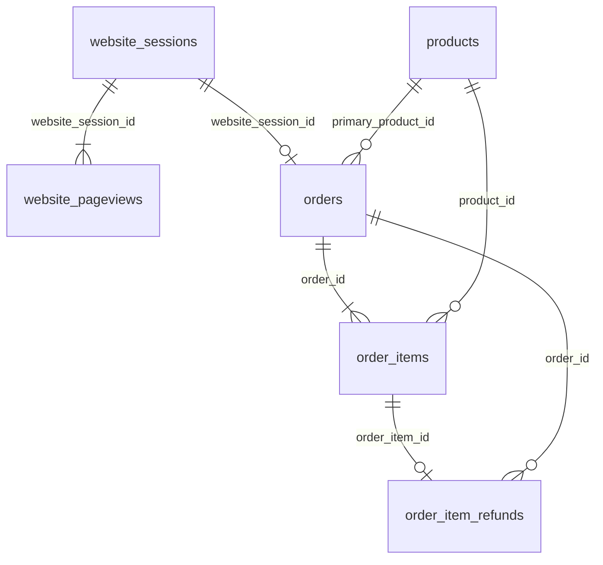

# Data understanding (Phase 1)

All numbers below come from `src/profile_raw.py` run on the raw CSVs.

## Tables

| Table | Rows | Date range | Grain |
|---|---:|---|---|
| website_sessions | 472,871 | 2012-03-19 to 2015-03-19 | one row per website visit |
| website_pageviews | 1,188,124 | 2012-03-19 to 2015-03-19 | one row per page viewed in a session |
| orders | 32,313 | 2012-03-19 to 2015-03-19 | one row per order (max one per session) |
| order_items | 40,025 | 2012-03-19 to 2015-03-19 | one row per product in an order |
| order_item_refunds | 1,731 | 2012-04-06 to 2015-04-01 | one row per refunded order item |
| products | 4 | launches 2012-03-19 to 2014-02-05 | one row per product |

## Relationships

- `user_id` appears in sessions and orders; there is no separate users table (394,318 distinct users).
- Each session has at most one order, and each order item is refunded at most once.

## Products

| product_id | product | launched | price | cogs |
|---:|---|---|---:|---:|
| 1 | The Original Mr. Fuzzy | 2012-03-19 | 49.99 | 19.49 |
| 2 | The Forever Love Bear | 2013-01-06 | 59.99 | 22.49 |
| 3 | The Birthday Sugar Panda | 2013-12-12 | 45.99 | 14.49 |
| 4 | The Hudson River Mini Bear | 2014-02-05 | 29.99 | 9.49 |

Prices and costs never change over time. Orders have 1 item (24,601) or 2 items (7,712).
Two-item orders start on 2013-09-25 (a second product can be added at the cart).
The Mini Bear was sold only as a cart add-on from 2014-02-05; its own product page appeared on 2014-12-05.

## Pages and the funnel

| pageview_url | first seen | last seen | sessions |
|---|---|---|---:|
| /home | 2012-03-19 | 2015-03-19 | 137,576 |
| /products | 2012-03-19 | 2015-03-19 | 261,231 |
| /the-original-mr-fuzzy | 2012-03-19 | 2015-03-19 | 162,525 |
| /cart | 2012-03-19 | 2015-03-19 | 94,953 |
| /shipping | 2012-03-19 | 2015-03-19 | 64,484 |
| /billing | 2012-03-19 | 2013-01-05 | 3,617 |
| /thank-you-for-your-order | 2012-03-19 | 2015-03-19 | 32,313 |
| /lander-1 | 2012-06-19 | 2013-03-10 | 47,574 |
| /billing-2 | 2012-09-10 | 2015-03-19 | 48,441 |
| /the-forever-love-bear | 2013-01-06 | 2015-03-19 | 26,033 |
| /lander-2 | 2013-01-14 | 2014-12-27 | 131,170 |
| /lander-3 | 2013-07-09 | 2015-03-19 | 79,000 |
| /the-birthday-sugar-panda | 2013-12-12 | 2015-03-19 | 19,046 |
| /lander-4 | 2014-02-02 | 2014-04-19 | 9,385 |
| /lander-5 | 2014-08-02 | 2015-03-19 | 68,166 |
| /the-hudson-river-mini-bear | 2014-12-05 | 2015-03-19 | 2,610 |

Funnel steps (strictly linear; no session skips a step):

1. Landing page (`/home` or `/lander-N`)
2. `/products`
3. Product page (`/the-original-mr-fuzzy`, `/the-forever-love-bear`, `/the-birthday-sugar-panda`, `/the-hudson-river-mini-bear`)
4. `/cart`
5. `/shipping`
6. `/billing` or `/billing-2`
7. `/thank-you-for-your-order` (= order placed; 32,313 sessions, same as the orders table)

Only `/home` and `/lander-N` pages are ever the first pageview of a session.

## Website experiments detected

A test is a page pair that received traffic on the same days, in the same segment, with a roughly 50/50 split.

| Test | Pages | Segment | Both live | Sessions (A / B) | Outcome in the data |
|---|---|---|---|---|---|
| T1 | /home vs /lander-1 | gsearch nonbrand, all devices | 2012-06-19 to 2012-07-29 | 2,328 / 2,381 | /lander-1 took 100% of gsearch nonbrand from 2012-07-30 |
| T2 | /lander-1 vs /lander-2 | paid nonbrand (gsearch + bsearch), all devices | 2013-01-14 to 2013-03-10 | 4,957 / 4,966 | /lander-2 took 100% from 2013-03-11 |
| T3 | /billing vs /billing-2 | all traffic | 2012-09-10 to 2013-01-05 | 1,663 / 1,657 | /billing-2 took 100% from 2013-01-06 |
| T4 | /lander-2 vs /lander-4 | paid nonbrand, desktop | 2014-02-02 to 2014-04-19 | 9,402 / 9,385 | /lander-4 was removed; /lander-2 kept |
| T5 | /lander-2 vs /lander-5 | paid nonbrand, desktop | 2014-08-02 to 2014-11-10 | 14,501 / 14,385 | /lander-5 took 100% of paid nonbrand desktop from 2014-11-11 |

Not a test: paid nonbrand **mobile** switched from /lander-2 to /lander-3 on 2013-07-09 with no overlap (a hard cutover). It can only be read as a before/after comparison, which is confounded by time.

## Traffic sources and channel grouping

| utm_source | utm_campaign | http_referer | sessions | channel_group |
|---|---|---|---:|---|
| gsearch | nonbrand | gsearch.com | 282,706 | paid_nonbrand |
| bsearch | nonbrand | bsearch.com | 54,909 | paid_nonbrand |
| gsearch | brand | gsearch.com | 33,329 | paid_brand |
| bsearch | brand | bsearch.com | 7,914 | paid_brand |
| socialbook | pilot | socialbook.com | 5,095 | paid_social |
| socialbook | desktop_targeted | socialbook.com | 5,590 | paid_social |
| NULL | NULL | gsearch.com | 35,202 | organic_search |
| NULL | NULL | bsearch.com | 8,209 | organic_search |
| NULL | NULL | NULL | 39,917 | direct_type_in |

Logic: a utm tag means the visit came from a paid ad. The campaign separates nonbrand (generic keywords) from brand (people searching the company name), and socialbook is paid social. No utm tag but a search-engine referer means an unpaid (organic) search click. No utm and no referer means the user typed the URL or used a bookmark (direct).

Devices: desktop 327,027 sessions, mobile 145,844. Repeat sessions: 78,553 (16.6%).

## Data quality

Checks that passed (0 problem rows):
- no duplicate primary keys and no full-row duplicates in any table
- no orphan keys: every pageview and order has a session, every item has an order, every refund has an item
- order price and cogs equal the sum of their items; `items_purchased` equals the item row count
- no refund is larger than the item price (all 1,731 refunds are full refunds)
- every session has at least one pageview; the first pageview timestamp equals the session start
- no session has more than one order; order and session `user_id` always match
- `is_repeat_session` = 1 exactly when the user has an earlier session

Things to keep in mind:
- NULL utm fields are not missing data. They mean organic or direct traffic (83,328 sessions).
- The first and last months are partial: March 2012 starts on the 19th, March 2015 ends on the 19th. Exclude them from monthly trend and growth comparisons, or flag them.
- Refunds run to 2015-04-01, after the last order, so recent months may be missing some late refunds.
- Products launched at different times, so product comparisons need the same date window.

## Data dictionary

| Table | Column | Type | Meaning |
|---|---|---|---|
| website_sessions | website_session_id | int (PK) | one website visit |
| | created_at | timestamp | session start |
| | user_id | int | visitor (cookie) id |
| | is_repeat_session | 0/1 | 1 if the user had an earlier session |
| | utm_source | text | ad platform: gsearch, bsearch, socialbook; NULL if not paid |
| | utm_campaign | text | nonbrand, brand, pilot, desktop_targeted |
| | utm_content | text | ad creative id |
| | device_type | text | desktop or mobile |
| | http_referer | text | referring site; NULL for direct type-in |
| website_pageviews | website_pageview_id | int (PK) | one page view, increasing in time |
| | created_at | timestamp | time of the view |
| | website_session_id | int (FK) | session it belongs to |
| | pageview_url | text | page path |
| orders | order_id | int (PK) | one order |
| | created_at | timestamp | order time |
| | website_session_id | int (FK) | session that placed the order |
| | user_id | int | buyer |
| | primary_product_id | int (FK) | first product added to cart |
| | items_purchased | int | 1 or 2 |
| | price_usd | numeric | order revenue |
| | cogs_usd | numeric | cost of goods for the order |
| order_items | order_item_id | int (PK) | one product line |
| | order_id | int (FK) | parent order |
| | product_id | int (FK) | product |
| | is_primary_item | 0/1 | 1 if it was the first item added |
| | price_usd / cogs_usd | numeric | item price and cost |
| order_item_refunds | order_item_refund_id | int (PK) | one refund |
| | created_at | timestamp | refund time |
| | order_item_id | int (FK) | refunded item |
| | order_id | int (FK) | parent order |
| | refund_amount_usd | numeric | amount refunded |
| products | product_id | int (PK) | product |
| | created_at | timestamp | launch date |
| | product_name | text | product name |
